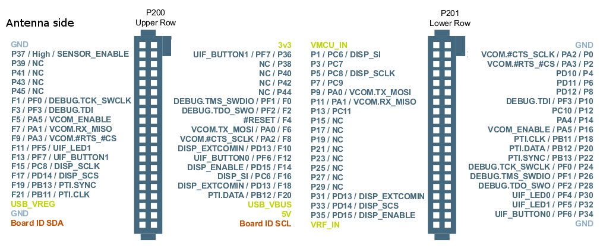

# Construction of Gekkokapula v1
BRD4151A radio board (with EFR32MG1P232F256GM48)
is connected to a display and a speaker.

The display is something like this: https://www.ebay.com/itm/232327157750

Speaker is driven from a PWM output through a series capacitor and a resistor.

| Board pin | EFR32 pin | Connection   |
|-----------|-----------|--------------|
|   GND     |           | Ground plane |
| VMCU\_IN  |           | +3.3 V       |
|   P1      |   PC6     | Display SDA  |
|   P3      |   PC7     | Display CS   |
|   P5      |   PC8     | Display SCK  |
|   P7      |   PC9     | Display AO   |
|   P12     |   PC10    | Display LED  |
|   P9      |   PA0     | Debug UART TX (currently not used) |
|   P11     |   PA1     | Debug UART RX (currently not used) |
|   P34     |   PF6     | PTT or CW key (switch to GND) (optional) |
|   P4      |   PD10    | PWM Audio out |
|   P6      |   PD11    | Encoder A (switch to GND) |
|   P8      |   PD12    | Encoder B (switch to GND) |
|   P31/F18 |   PD13    | Encoder push button (switch to GND) |
|   F14     |   PD15    | Audio in, biased around 0.625 V |
|   P24     |   PF0     | J-link SWCLK |
|   P26     |   PF1     | J-link SWDIO |

VCC and RESET pins on display are connected to +3.3 V.

If you push wires straight to the radio board headers, reading pinout from the
datasheet is prone to mistakes as you are looking at it mirrored.
Here's a mirrored pinout to help:

## Flashing
See [flashing tutorial](../firmware/flashing.md).
Should I just add compiled firmware binaries here in the repository?
